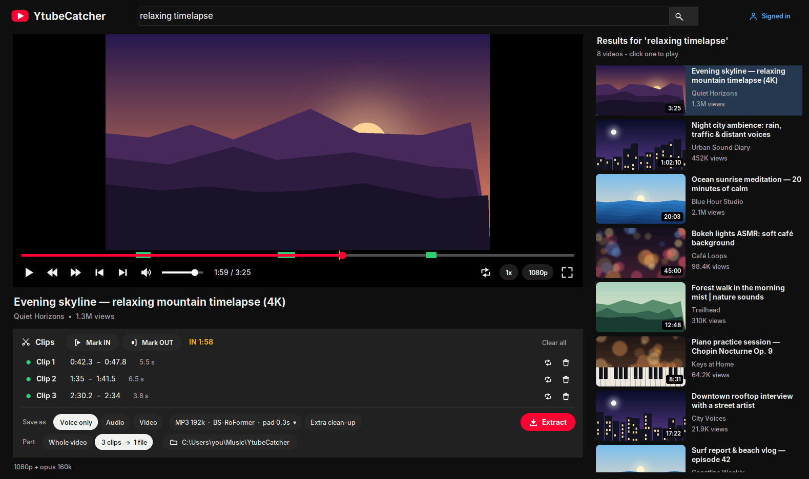
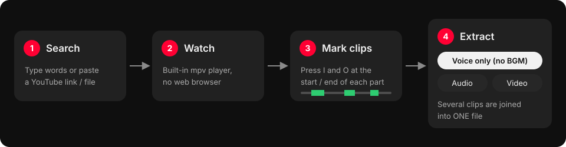
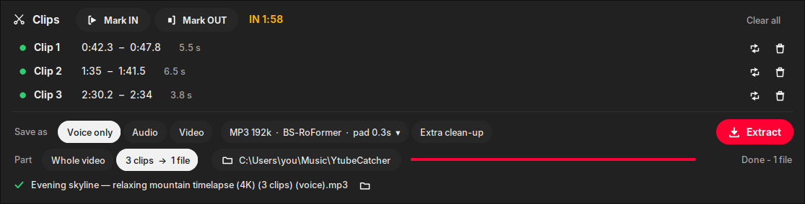
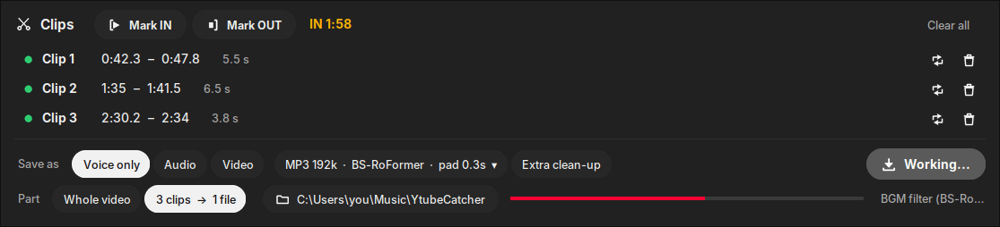
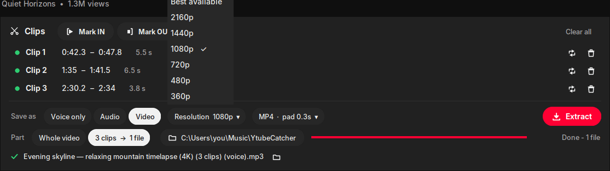
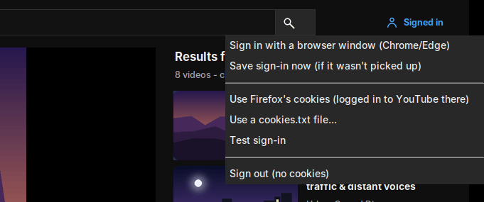

<div align="center">

# YtubeCatcher

**Search, watch and cut YouTube videos, then save just the parts you want: the voice alone (background music removed), the audio, or the video.**

One window, no web browser, no API key. Runs locally on Windows.



</div>

## How it works

<p align="center"></p>

1. **Search** YouTube from the top bar, or paste a link (or a local video file). Results appear on the right with thumbnails, length, channel and views.
2. **Watch** in the built-in player (mpv). yt-dlp finds the stream; quality goes up to 4K, and there's an audio-only option.
3. **Mark clips** with <kbd>I</kbd> (in) and <kbd>O</kbd> (out). Each clip shows up green on the seek bar. Use <kbd>,</kbd> <kbd>.</kbd> to step one frame for exact cuts, and <kbd>L</kbd> to loop a clip and check it.
4. **Extract** as *Voice only*, *Audio* or *Video*. Several clips are joined into **one file**; with no clips, the whole video is saved.

## Features

### Clips and one-click extraction



- **Every video keeps its own clips.** Switch to another video and its clips (and an unfinished IN mark) are put aside; switch back and they return. Clips are saved between sessions, and the same video opened through any kind of link shares them.
- **Save as:** *Voice only*, *Audio* (MP3 / M4A / WAV / FLAC / OPUS with your choice of bitrate) or *Video* (MP4).
- **Part:** *Whole video*, or *N clips → 1 file*. Clips are joined in order with a 0.5 s gap. Each clip is padded (0.3 s by default) so no word gets cut in half.
- Finished files are listed under the panel. Click one to play it back in the player, or click the folder icon to show it in Explorer.

### Voice only: background music removed



The **BGM filter** separates the voice from music and effects using the **BS-RoFormer** AI vocal model. Pauses between words come out silent. It's made for building clean voice references, for example for voice cloning or text-to-speech. An optional **Extra clean-up** pass (Mel-RoFormer) also removes room noise, wind and ambience. It runs on an NVIDIA GPU when there is one. Setup is one-time: click *Voice only ↓* and the app offers to install it (about 3.5 GB).

### Video at the resolution you choose



In *Video* mode, the **Resolution** menu sets the download resolution: best available, or 2160p down to 360p. Cuts are frame-accurate, and clips are combined into one MP4.

### Sign in with your YouTube account



You need to sign in only for age-restricted or members-only videos, or when YouTube asks you to confirm you're not a bot. Choose **Sign in with a browser window**, then log in to YouTube in the Chrome/Edge window that opens. The app notices the login by itself and saves it, and the button changes to *Signed in*. Your password is never typed into the app, and the window keeps its own profile, so you stay logged in next time. Firefox cookies or an exported `cookies.txt` also work.

### Built to look clean

A dark, YouTube-style interface. It's DPI-aware, so text stays sharp on 125–200 % displays. Icons, buttons and knobs are drawn anti-aliased. Titles in Chinese, Japanese and Korean use Microsoft YaHei UI.

## Quick start (Windows)

1. Install **Python 3.10+** (tick *Add python.exe to PATH*).
2. Double-click **`run.bat`**. The first run sets everything up next to the app: a Python virtual environment, yt-dlp, ffmpeg, the mpv player library (`libmpv-2.dll`), Pillow, and **Deno** (the JavaScript runtime yt-dlp needs for YouTube).
3. Optional, for *Voice only*: click *Voice only ↓* in the app, or run **`install_vocals.bat`**.

Later launches start straight away. `run.bat` also updates yt-dlp each time, because YouTube changes often.

## Keyboard shortcuts

| Key | Action | Key | Action |
|---|---|---|---|
| <kbd>Space</kbd> / <kbd>K</kbd> | Play / pause | <kbd>I</kbd> | Mark clip IN |
| <kbd>←</kbd> <kbd>→</kbd> | Back / forward 5 s | <kbd>O</kbd> | Mark clip OUT |
| <kbd>Shift</kbd>+<kbd>←</kbd> <kbd>→</kbd> | Back / forward 1 s | <kbd>L</kbd> | Loop the selected clip (again: stop) |
| <kbd>J</kbd> | Back 10 s | <kbd>Del</kbd> | Delete the selected clip |
| <kbd>,</kbd> <kbd>.</kbd> | Previous / next frame | <kbd>M</kbd> | Mute |
| <kbd>F</kbd> / double-click | Full screen (<kbd>Esc</kbd> to leave) | <kbd>Enter</kbd> | Search / open the pasted link |

## Output

Files go to `Music\YtubeCatcher` in your user folder unless you pick another folder. Names include the video title and what was saved:

```
Evening skyline — relaxing mountain timelapse (4K) (3 clips) (voice).mp3
Evening skyline — relaxing mountain timelapse (4K) (3 clips).mp4
Evening skyline — relaxing mountain timelapse (4K).m4a
```

Title and artist metadata are embedded in audio files.

## More ways to use it

**Batch window:** `run.bat --classic` opens the older YtubeCatcher window. It handles many URLs at once, whole playlists, a free-form timeline box (`6:57-7:02`, `06:57 ~ 07:02`, `#2 1:00-1:20` for input no. 2), start/end limits, keeping the original mix, and a waveform/picture preview panel.

**Command line:**

```bat
run.bat "https://www.youtube.com/watch?v=XXXX" -f mp3 -b 320
run.bat URL --video --res 1080                                 (MP4, max 1080p)
run.bat URL --timeline "6:57-7:02, 12:10-12:30" --filter-bgm --combine
run.bat URL --filter-bgm --denoise -f flac                     (voice only + extra clean-up)
run.bat "D:\clips\interview.mp4" --filter-bgm                   (local files work too)
run.bat PLAYLIST_URL --playlist -o D:\audio
run.bat --search "piano practice" --search-limit 10            (search, print URLs)
run.bat URL --cookies youtube_cookies.txt                      (download signed in)
```

`run.bat --help` lists every option.

## Troubleshooting

| You see | What to do |
|---|---|
| *Requested format is not available* | This usually happens while you're signed in, before Deno is installed. The app then plays the video signed out and sets Deno up automatically. If Deno can't be downloaded, run `winget install DenoLand.Deno`. |
| *Could not copy Chrome cookie database* | Chrome and Edge lock and encrypt their cookies, so other apps can't read them. Use **Sign in → Sign in with a browser window** instead. |
| *Voice only ↓* | The BGM filter isn't installed yet. Click it to install (one time, about 3.5 GB). |
| Playback or downloads suddenly fail | YouTube changed something. Relaunch with `run.bat`, which updates yt-dlp. |

## Project layout

```
ytubeviewer.py      the app (player, clips, extract, sign-in)
ytubecatcher.py     the engine: download, cut, BGM filter, combine; also the classic window and the CLI
run.bat             setup + launcher        install_vocals.bat   optional BGM filter (PyTorch, BS-RoFormer, Demucs)
docs/               README screenshots and diagram
```

The screenshots use generated demo artwork and invented titles.

## Use responsibly

Download only content you own or have permission to use. Downloading may break YouTube's Terms of Service, and the audio and video remain under their owners' copyright.
